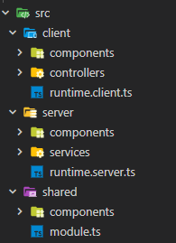

# Flamework
Flamework is a highly opinionated (and currently experimental) game framework.
It requires typescript and offers many useful features and abstractions.


## Installation

1. Setup a roblox-ts project
	- Create a project folder
	- Run `rbxtsc init` and select game
	- Select your preferred settings

2. Install @rbxts/flamework
	- Run `npm i @rbxts/flamework`
	- Run `npm i -D rbxts-transformer-flamework`

3. Enable the transformer
	- Put the following into your tsconfig.json, under compilerOptions
	```json
	"experimentalDecorators": true,
	"plugins": [
		{ "transform": "rbxts-transformer-flamework" }
	]
	```

4. Delete the `out` directory.

5. Compile!
	- Note: You must use the master branch (rbxtsc-dev) of roblox-ts until the next release.


# Usage

## Setting up Flamework

It's up to you how you wish to structure your project, however you'll likely want to do a structure similar to this.



Within runtime.server.ts and runtime.client.ts, you'll want to import Flamework and preload your controllers, services, etc.

```ts
import { Flamework } from "@rbxts/flamework";

// server
Flamework.addPaths("src/server/services", "src/server/components");

// client
Flamework.addPaths("src/client/controllers", "src/client/components");

// both, after preloading
Flamework.ignite();
```

After doing that, you can now start creating controllers, services and components.

## Creating a Service

Flamework uses decorators to annotate classes as a service, controller or component.

Services are singletons, meaning only one instance will be created by Flamework.

```ts
@Service({
	// This determines what order this service will load.
	// 0 = sooner, the default is 1
	loadOrder: 0,
})
export class MyService implements OnStart {
	onStart() {
		print("My service has started!");
	}
}
```

## Creating a Controller

Controllers are equivalent to Services, except they run on the client and have access to the OnRender lifecycle event.

Controllers are singletons, meaning only one instance will be created by Flamework.

```ts
@Controller({
	// This determines what order this service will load.
	// 0 = sooner, the default is 1
	loadOrder: 0,
})
export class MyController implements OnStart, OnRender {
	onStart() {
		print("My service has started!");
	}

	onRender(dt: number) {
		print("I am rendering!");
	}
}

```

## Dependencies

Arguably the most important part, is the ability to grab instances of controllers and services.

There are two ways to get an instance of a service or controller.

### Constructor Dependency Injection

When defining your component, service or controller, you can specify dependencies in the constructor and they will automatically be passed into the constructor.

```ts
import { MyOtherService } from "..";

class MyService {
	constructor(private myOtherService: MyOtherService) {}

	myFunc() {
		this.myOtherService.otherFunc();
	}
}
```

### Dependency macro

There may be cases where you can't, or don't want to, use constructor DI. In cases like these, you can use the `Dependecy` macro to grab a dependency.

```ts
import { MyService } from "..";
import { Dependency } from "@rbxts/flamework";

// Syntax 1
const myService_1 = Dependency<MyService>();

// Syntax 2
const myService_2 = Dependency(MyService);
```

## Components

Flamework supports components (similar to Unity) that you can attach to instances, and hook into lifecycle events.

They will be automatically attached to instances if a Tag field is specified, as well as destroyed.

### Component class

```ts
@Component({
	tag: "my-collection-service-tag",
})
class MyComponent extends BaseComponent implements OnStart {
	onStart() {
		print(this.instance);
		this.maid.GiveTask(...);
	}

	destroy() {
		super.destroy();
		// cleanup
	}
}
```

### Using attributes

Components natively supports attributes which will have type guards automatically generated.
```ts
interface Attributes {
	myAttribute: string,
	myType: "specific" | "strings",
	myOtherAttribute: 1 | 2,
}

@Component({
	tag: "my-collection-service-tag",
})
class MyComponent extends BaseComponent<Attributes> implements OnStart {
	onStart() {
		print(
			this.attributes.myAttribute,
			this.attributes.myType,
			this.attributes.myOtherAttribute
		)
	}
}
```

### Scripting API

You can use the Components scripting API to grab a component attached to an instance.

For cases where CollectionService tags are not appropriate, or do not fit your use case, you can also use the API to add and remove components.

The API is exposed as a service/controller, so you can fetch it using the Dependency macro or constructor DI.

```ts
import { Components } from "@rbxts/flamework";

const components = Dependency<Components>();
components.addComponent<MyComponent>(game);

const myComponent = components.getComponent<MyComponent>(game);
myComponent.method();

components.removeComponent<MyComponent>(game);
```

# Execution model


## OnInit
The OnInit event is called sequentially for every service and controller.
Yielding in OnInit will delay the initialization of other services/controllers.
Important initialization should be done in this event.

It is generally not safe to use other dependencies in OnInit.

## OnStart
The OnStart event is called after OnInit for all services/controllers.
Yielding in one will not delay starting of other services.

This is also called for components, after being instantiated onto an instance.

## OnTick, OnPhysics, OnRender

These events connect to the corresponding RunService event.
| Lifecycle Event | RunService Event |
|-----------------|------------------|
| OnTick          | Heartbeat        |
| OnPhysics       | Stepped          |
| OnRender        | RenderStepped    |

# Networking

Flamework comes with a networking solution built in. Flamework's networking is designed with the intent of being as simple as possible and requiring as little user intervention as possible.

## Registering events

```ts
// somewhere in shared
import { Flamework } from "@rbxts/flamework";

// These are events that get called by the client.
interface ServerEvents {
	hit(humanoid: Humanoid): void;
}

// These are events that get called by the server to a player.
interface ClientEvents {
	stateUpdate(key: string, value: unknown): void;
}

export const GlobalEvents = Flamework.createEvent<ServerEvents, ClientEvents>();

// GlobalEvents returns two versions of the networking.
// You likely don't want to have to do GlobalEvents.server each time,
// so it's recommended you re-export the server/client versions
// in their own file.

// in server/events.ts
import { GlobalEvents } from "..";

export const Events = GlobalEvents.server


// in client/events.ts
import { GlobalEvents } from "..";

export const Events = GlobalEvents.client
```

## Using events on the server
The server is able to broadcast to all players, broadcast to all players except certain ones and fire to specific players.

```ts
import { Events } from "server/..";

// Fire to all players
Events.stateUpdate.broadcast("myKey", "myValue");

// Fire to all players except
Events.stateUpdate.except(player, "myKey", "myValue");
Events.stateUpdate.except([player1, player2], "myKey", "myValue");

// Fire to specific player
Events.stateUpdate(player, "myKey", "myValue");

// Connect to an event
Events.connect("hit", (player, humanoid) => {
	print(`${player.Name}) damaged a humanoid!`);
	humanoid.TakeDamage(25);
})
```

## Using events on the client
Identical to the server, except you cannot use .broadcast or .except

```ts
import { Events } from "client/..";

// Fire to server
Events.hit(humanoid);

// Connect to an event
// You can specify additional type constraints which will
// be enforced at runtime simply by specifying the parameter type!
const myState = new Map<string, string>();
Events.connect("stateUpdate", (key, value: string) => {
	myState.set(key, value);
})
```
